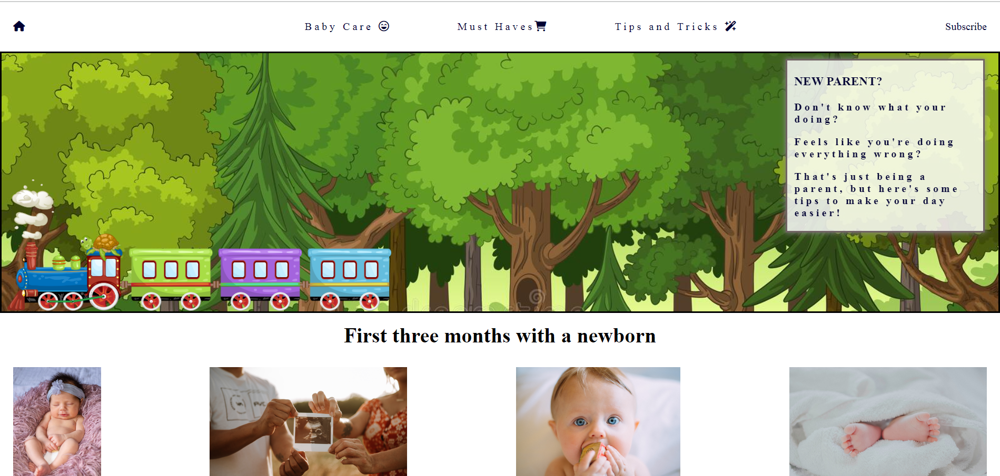
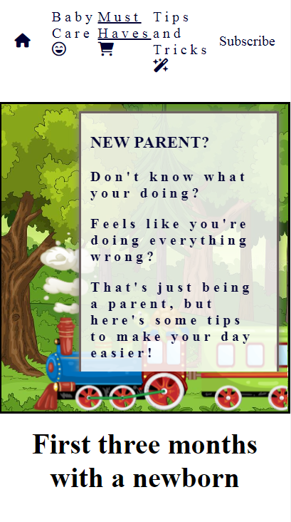
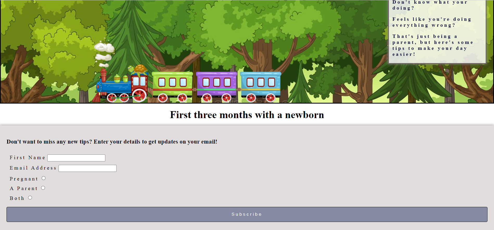
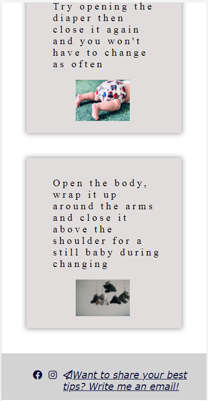

# New parent

New parent is a website filled with tips to simplify the first three months with a newborn. It targets all parents with a young baby and hopes to make their life easier, both for the baby and the parent/parents. The information will be useful accomplishing eating, stomachaches, putting babies to sleep and much more.

## Features

### Navigation Bar

* The navigation bar includes responsive links to home page, baby care, must haves, tips and tricks and subscribe page. 
* Each link besides the home icon will be underlined when used to show the user which page they are on.

* **asterisks** Element is constant on each page for easy navigation.

### The landing image

* The first image shown is a forest with a moving train on it to show the user directly that it's a sight regarding kids. 
* After a few seconds their will pop up a window with text hoping to ensure the parents that what they might be feeling about their new life is normal.  

* **asterisks** Element is constant on each page for easy navigation.

### Header- First three months with a newborn

* The header informs that the information on this sight mainly targets the first three months with the baby. 

* **asterisks** Element is constant on each page for easy navigation.

### The Pictures

* The pictures of four babies are added for recognition.

### The Footer

* The Footer has navigation links that opens in a new window when used. One to our Facebook page, one for Instagram and one to our email if you would like to send in a tip, which is also put next to the email icon.

* **asterisks** Element is constant on each page for easy navigation.

### Baby Care

* Baby care provides three informational cards. 

1. First one about what clothes to preferably buy. 
2. Second one to easier cope and save energy. 
3. Third one regarding babies health.

### Must Haves

* Must haves has four informational cards with a heading named after the item you should buy, and linked picture of the item that when clicked opens up a new window showing where you can buy it and a text section telling the user what it’s good for.

### Tips and Tricks 

* Tips and Tricks contain four cards regarding tips that doesn’t go under the subject baby care or must haves. 
* Each one have a photo matching the tip.

### Subscribe

* The subscribe page has a form to get updates on users email when new tips are added. To receive an email the user must enter their first name, email address and enter if they are a parent, pregnant or both.

## Features Left to Implement

1. On home page I would prefer it to be moving pictures of kids, like giffs or shorter movies. Maybe an audio of some baby laughter.

2. There should be pictures or videos to all cards with shown content on how to do the specific tip. For example on tips and tricks there is one card telling you to button the body over babies shoulder to make them stay still. It would be more informative with a video showing the tip. Or on the card that mentions white noises it could be a playlist to use.

3. On the banner image for desktop the train could be pulling the cover text on screen instead of having it pop when the train have passed.

## Testing

1. My page with it's animations and cards appear good on desktop (1201px and up) and also on smaller screens (1200px and below). 

2. Page works good on chrome, firefox, iphone and android. On explorer the pictures in the index file has another width and also the train isn't appearing.

3. All links are tested in each try of diffrent browsers and all opens in a new window.

### Validator Testing

Url for new parent is tested in both [W3C-validator](https://validator.w3.org/) and [W3C-CSS-validaor](http://jigsaw.w3.org/css-validator/validator?lang=sv&profile=css3svg&uri=https%3A%2F%2Fohdamnitsnikki.github.io%2Fnew-parent%2F&usermedium=all&vextwarning=&warning=1)

### Deployment 

**_New Parent_** is deployed to GitHub pages, this was the steps:
* Through the GitHub repository go to settings
* Click on pages and use the branch menu to choose "main"
* Refresh the page and a link to the final project will be deployed

Live link here - [New Parent](https://ohdamnitsnikki.github.io/new-parent/)

* On the main sight there is a fork button to create your own repositry with out affecting the orginal project or you can go into the project file and use the code button and clone the project directly.

## Credits

1. The template is taken from [Code Institute](https://github.com/Code-Institute-Org/gitpod-full-template)
2. For help during these projects I've used my mentor and the tutors.
3. To get inspired about box-shadows and subsribe button I've used [W3School](https://www.w3schools.com/)
4. The Cover-text and form section was inspired by the [Love Running project](https://code-institute-org.github.io/love-running-2.0/index.html)

### Media

* The pictures was mostly found on google and some on [Unsplash](https://unsplash.com/)
* The Icons are taking from [Font awesome](https://fontawesome.com/icons)
